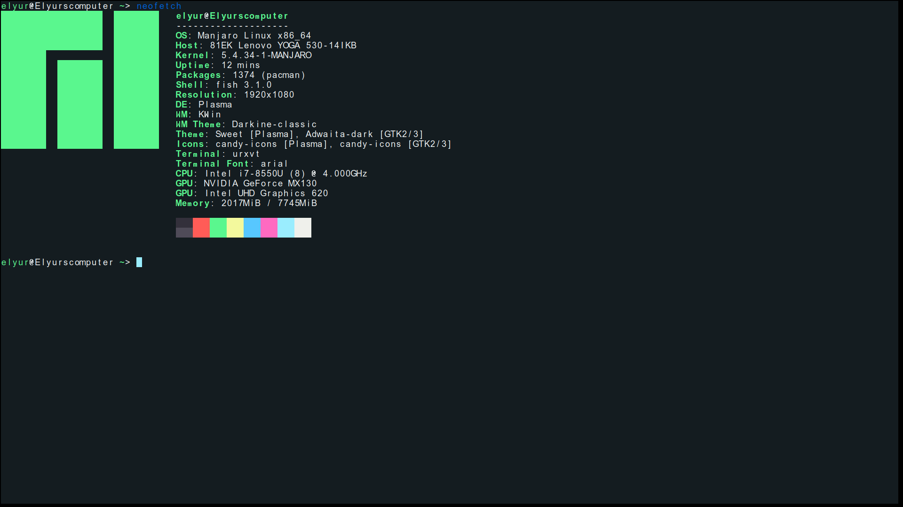

# role_play_game

My game's main file is elyscaper.py

It can only be used on an Unix system, because of the music player. If you take the music player of elscaper.py away, it should work on Windows. You should delete though the lines 53-71, all the occurrences of kill_music() and next_music() inside elyscaper.py and the lines 618-619.

You should also use a dark terminal, as specified at the beginning of the game. See an example:

